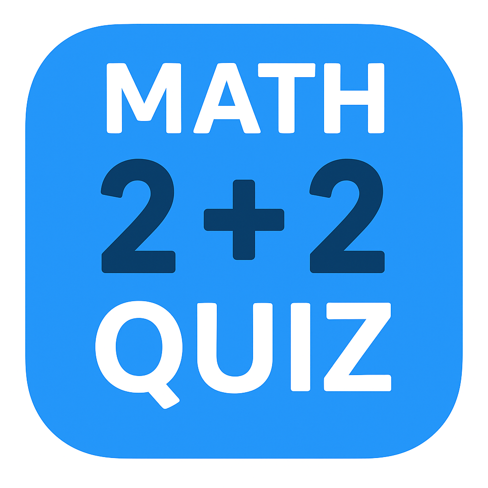

# Math Quiz

A cross-platform app that provides customizable math question sets for learning, practice, or skill refresh.

## Contributing

This project is open source, and contributions are welcome!
If you’d like to add your own question sets or improve existing ones, feel free to submit a pull request.
We appreciate all contributions that help make the quiz better for everyone.

## Link to Webversion
[Current state of quiz](https://josefgull.github.io/math_quiz/)